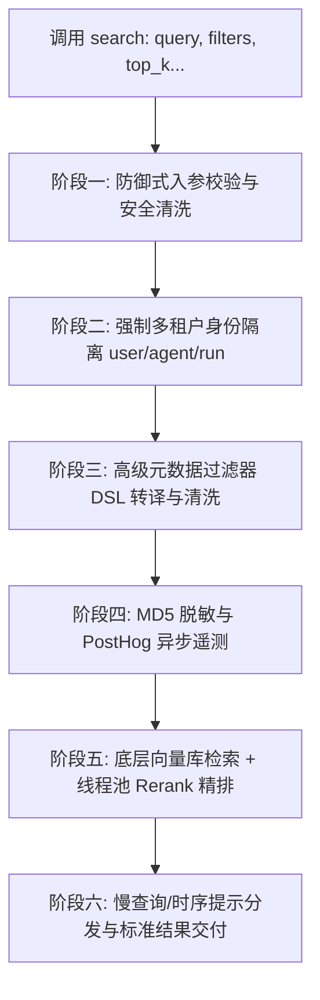

# 第三章：记忆检索核心流水线 —— 深入解析 search() 实现

## 本章导读

在 AI Agent 的记忆体系中，"写得进"只是基础，"查得准、控得精、跑得稳"才是核心。当用户向 AI 提问："我上周提到我喜欢喝什么咖啡？" 时，Mem0 底层就会触发 `search()`。

本章我们将深入拆解 Mem0 的异步检索方法 `async def search()`，看它如何通过 6 大阶段实现防御式安全校验、类 Mongo 过滤语法转译、两阶段检索（向量召回 + 异步重排）、隐私脱敏遥测与性能预警。

## 3.1 检索主流程架构图

在逐行阅读代码前，我们先通过全景流程图理清 `search()` 内部的数据流转：



## 3.2 源码逐段深度拆解

### 阶段一：防御式入参校验与安全清洗

```python
if reference_date is not None:
    raise ValueError(
        await get_temporal_feature_error_message_async("async", "search", "reference_date")
    )

# Reject top-level entity params - must use filters instead
_reject_top_level_entity_params(kwargs, "search")

# Validate search parameters (before applying defaults)
_validate_search_params(threshold=threshold, top_k=top_k)
query = _validate_and_trim_search_query(query)
temporal_usage_notice = detect_temporal_usage_from_search(query, filters)
```

💡 核心设计与代码细节：

1. **商业特性硬隔离（Fail-Fast 原则）**：
   - `reference_date`（基于参考日期的历史时间旅行/记忆衰减计算）属于商业版（Platform）专享功能。开源版一旦接收到此参数，直接抛出 `ValueError` 并给出清晰引导，避免参数静默失效导致开发者困惑。
2. **顶层参数拦截（防呆设计）**：
   - `_reject_top_level_entity_params(kwargs, "search")` 会检查 `kwargs` 中是否存在历史遗留写法（如直接传 `search(..., user_id="u1")`）。框架强制要求统一收敛至 `filters={"user_id": "u1"}`，保证 API 签名规范统一。
3. **参数强校验与 Python 隐蔽 Bug 防御**：
   - 在 `_validate_search_params` 中，除了校验 `threshold` 处于 [0, 1] 之间外，针对 `top_k` 专门编写了 `not isinstance(top_k, int) or isinstance(top_k, bool)`。
   - 为什么这样写？在 Python 中 `bool` 是 `int` 的子类（`isinstance(True, int) == True`）。若不显式排除 `bool`，传入 `top_k=True` 会被隐式当成 1 执行，此处防御杜绝了潜在的类型穿透 Bug。
4. **时序意图嗅探**：
   - `detect_temporal_usage_from_search` 利用正则表达式识别用户是否查询了 `"yesterday"`、`"2024-05-01"` 或在 `filters` 中设置了日期范围，为后续的诊断提示做准备。

### 阶段二：强制多租户身份隔离（数据安全红线）

```python
# Validate and trim entity IDs in filters
effective_filters = filters.copy() if filters else {}
if "user_id" in effective_filters:
    effective_filters["user_id"] = _validate_and_trim_entity_id(
        effective_filters["user_id"], "user_id"
    )
if "agent_id" in effective_filters:
    effective_filters["agent_id"] = _validate_and_trim_entity_id(
        effective_filters["agent_id"], "agent_id"
    )
if "run_id" in effective_filters:
    effective_filters["run_id"] = _validate_and_trim_entity_id(
        effective_filters["run_id"], "run_id"
    )

# Validate filters contains at least one entity ID
if not any(key in effective_filters for key in ("user_id", "agent_id", "run_id")):
    raise ValueError(
        "filters must contain at least one of: user_id, agent_id, run_id. "
        "Example: filters={'user_id': 'u1'}"
    )
```

💡 核心设计与代码细节：

1. **防止原对象修改副作用（Side Effect）**：
   - 使用 `filters.copy() if filters else {}` 做浅拷贝。后续所有去空格、格式转译均在 `effective_filters` 上操作，绝不篡改调用方传进来的外部原字典。
2. **ID 强规范化（`_validate_and_trim_entity_id`）**：
   - 自动类型兼容：将数字整型（如数据库主键 `user_id=1024`）自动强制转为字符串 `"1024"`，避免类型不一致导致向量库精确匹配失效；
   - 脏空格清洗：执行 `.strip()` 去除首尾空格，拦截空字符串 `""`；
   - 禁止中间空格：若 ID 内部包含空格（如 `"user 001"`），立即抛出异常。因为空格在 URL 路由、RESTful API 路径和向量数据库 Keyword 索引中极易引发解析错误。
3. **强制多租户约束（必须传 filters）**：
   - `any(key in effective_filters for key in ("user_id", "agent_id", "run_id"))`
   - 为什么不允许无条件全局搜索？多租户 AI 系统中，若允许全库扫描，一是极易导致跨用户隐私泄露，二是数百万级向量的全库暴力比对会导致响应延迟激增甚至打崩数据库。

### 阶段三：高级元数据操作符转译与清洗

```python
limit = top_k
scale_threshold_notice = detect_scale_threshold_from_top_k(top_k)

# Apply enhanced metadata filtering if advanced operators are detected
if self._has_advanced_operators(effective_filters):
    processed_filters = self._process_metadata_filters(effective_filters)
    # Remove logical/operator keys that have been reprocessed
    for logical_key in ("AND", "OR", "NOT"):
        effective_filters.pop(logical_key, None)
    for fk in list(effective_filters.keys()):
        if fk not in ("AND", "OR", "NOT", "user_id", "agent_id", "run_id") and isinstance(effective_filters.get(fk), dict):
            effective_filters.pop(fk, None)
    effective_filters.update(processed_filters)
```

💡 核心设计与代码细节：

1. **抹平底层向量库语法差异**：
   - Mem0 支持类似 MongoDB 的高级查询语法（如 `gt`、`gte`、`in`、`AND`、`OR`）。`_process_metadata_filters` 充当"通用翻译官"，将这些语法统一转译为标准中间表达（IR）。
2. **新旧数据清洗替换（新旧换血）**：
   - 防止未加工语法砸崩数据库：原始的 `"AND"`、`"OR"` 必须通过 `.pop()` 移除，否则向量数据库（如 Qdrant/Chroma）在没有对应字段时会报 500 崩溃；
   - 快照遍历避坑：使用 `list(effective_filters.keys())` 生成静态快照后再遍历删除，防止出现 Python `RuntimeError: dictionary changed size during iteration` 异常；
   - 白名单安全保护：在剔除旧的嵌套字典时，明确跳过 `("user_id", "agent_id", "run_id")`，确保核心租户隔离身份绝对不丢失。

### 阶段四：隐私脱敏与旁路遥测上报

```python
keys, encoded_ids = process_telemetry_filters(effective_filters)
capture_event(
    "mem0.search",
    self,
    {
        "limit": limit,
        "version": self.api_version,
        "keys": keys,
        "encoded_ids": encoded_ids,
        "sync_type": "async",
        "threshold": threshold,
        "explain": explain,
        "advanced_filters": bool(filters and self._has_advanced_operators(filters)),
    },
)
```

💡 核心设计与代码细节：

1. **MD5 单向哈希隐私脱敏**：
   - `process_telemetry_filters` 会将真实的 `user_id`（如手机号、邮箱）通过 `hashlib.md5().hexdigest()` 转化为 32 位乱码字符串。
   - 效果：官方后台既无法反推用户的敏感明文，又能通过相同的哈希值完成独立的 UV/PV 统计。
2. **技术栈画像收集**：
   - `capture_event` 提取当前实例的架构选型（如 `vector_store` 类型、`llm` 类名、`embedding_model` 维度），结合系统环境（OS、CPU 架构）通过 PostHog 异步上报。
3. **旁路静默容错**：
   - 内部使用 `try...except` 吞掉所有网络和序列化异常，并通过 `MEM0_TELEMETRY` 环境变量（可设为 `False`）支持完全离线禁用，埋点失败绝不影响主检索逻辑。

### 阶段五：两阶段检索流水线（召回 + 异步重排）

```python
search_start = time.perf_counter()
original_memories = await self._search_vector_store(
    query, effective_filters, limit, threshold, explain=explain, show_expired=show_expired
)
search_elapsed_seconds = time.perf_counter() - search_start

# Apply reranking if enabled and reranker is available
if rerank and self.reranker and original_memories:
    try:
        # Run reranking in thread pool to avoid blocking async loop
        reranked_memories = await asyncio.to_thread(
            self.reranker.rerank, query, original_memories, limit
        )
        original_memories = reranked_memories
    except Exception as e:
        logger.warning(f"Reranking failed, using original results: {e}")
```

💡 核心设计与代码细节：

1. **单调高精度时钟度量**：
   - 采用 `time.perf_counter()` 计算检索净耗时，不受系统对时（NTP）或夏令时时钟跳变的影响。
2. **两阶段检索架构（Vector Recall + Cross-Encoder Rerank）**：
   - 阶段 1（向量粗召回）：`_search_vector_store` 负责将 `query` 转为向量，从向量库中按 `threshold` 过滤出前 `top_k` 条记忆；
   - 阶段 2（语义精排）：若启用 `rerank`，则调用更精准的重排模型重新打分。
3. **`asyncio.to_thread` 防止事件循环阻塞**：
   - 重排计算（本地模型推理或同步 SDK 网络请求）是典型的 CPU 密集/同步阻塞任务。直接在异步函数中运行会卡死 Python 主事件循环。
   - 通过 `asyncio.to_thread` 将计算抛到后台线程池执行，保证了高并发服务下的非阻塞吞吐能力。
4. **优雅降级（Graceful Degradation）**：
   - 重排逻辑外层包裹 `try...except`。一旦 Reranker 出现网络超时或 OOM，只记录 warning 日志，程序自动回退为第一阶段的粗筛结果，保证业务调用不中断。

### 阶段六：性能告警与标准结果交付

```python
if temporal_usage_notice:
    await display_temporal_usage_notice_async(self, "async", "search", *temporal_usage_notice)
elif scale_threshold_notice:
    await display_scale_threshold_notice_async(self, "async", "search", *scale_threshold_notice)
elif search_elapsed_seconds > PERFORMANCE_SLOW_QUERY_THRESHOLD_SECONDS:
    await display_performance_slow_query_notice_async(
        self,
        "async",
        "search",
        search_elapsed_seconds,
        top_k,
        len(original_memories),
    )
else:
    await display_first_run_notice_async(self, "async", "search")
return {"results": original_memories}
```

💡 核心设计与代码细节：

1. **优先级通知路由**：
   - 采用 `if-elif-else` 阶梯结构，单次查询最多只打印一条最关键的终端提示：
     - 时间语义提示：指导开发者更精准地结合时间过滤器；
     - 大规格告警：`top_k` 过大时提示内存与网络延迟风险；
     - 慢查询预警（Slow Query Alert）：检索耗时超过阈值时，打印诊断日志，提示检查 HNSW/IVF 索引配置；
     - 新手引导：首次运行时输出快速上手指引。
2. **统一标准契约输出**：
   - 结果统一包装在 `{"results": [...]}` 字典中返回，为后续 API 扩展全局统计字段（如分页总数、耗时元数据）预留兼容空间。

## 3.3 架构总结与工程启示

通读 `search()` 源码，我们可以提炼出开发工业级 AI 框架的 4 个关键准则：

| 架构准则 | 代码落地体现 | 解决的核心问题 |
| :--- | :--- | :--- |
| **租户安全第一** | 强制要求 `user_id / agent_id / run_id` | 杜绝由于调用疏忽导致的全库扫描与多租户数据泄露 |
| **存储接口解耦** | 通用 DSL 操作符转换中间表达（IR） | 屏蔽 Qdrant、Chroma、Milvus 等底层向量数据库的语法差异 |
| **异步并发保护** | `asyncio.to_thread` 调度 Reranker | 避免 CPU 密集型重排推理冻结 asyncio 主事件循环 |
| **高可用弹性降级** | 局部 `try...except` 包裹 Rerank 与遥测 | 外部辅助服务或重排挂掉时，核心业务流程绝不中断 |

## 🔜 下一章预告

**第 4 章：记忆的生命周期演进 —— add() 背后如何做智能合并与去重？**

当用户说"我戒掉拿铁了，现在只喝美式"，系统是直接新增一条，还是把旧的修改掉？下一章我们将深入源码，拆解 Mem0 最精妙的记忆相似度判定与动态更新（Update / Add / Delete）决策图。
