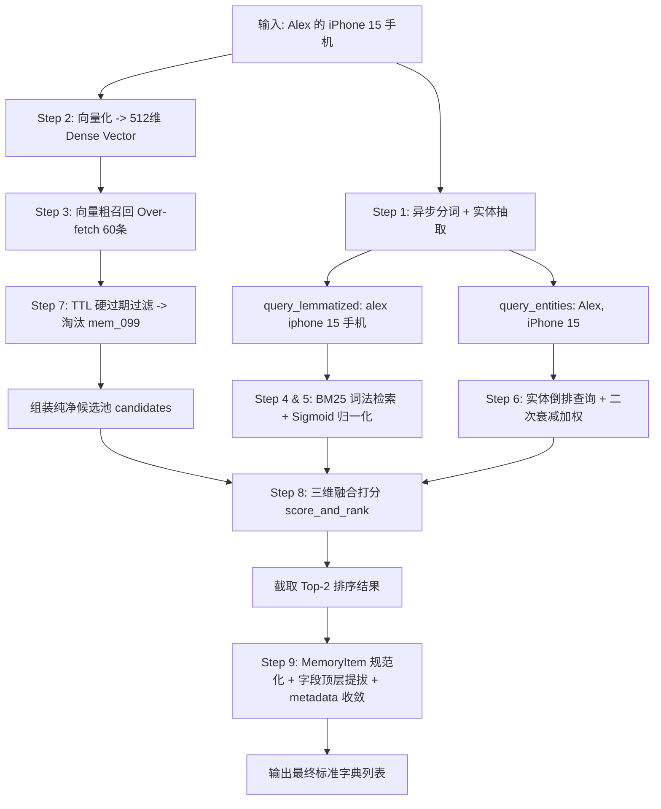

# 深入解析 `_search_vector_store`：Mem0 混合检索的 9 步流水线

上一篇文章我们把 `search()` 外层那套参数校验、多租户隔离和过滤器转译都过了一遍。说实话，那部分更像"守门员"——真正决定检索质量的核心引擎在门后面，也就是今天要拆的 `_search_vector_store`。

这个方法是 Mem0 整个记忆系统里最有分量的一段代码：它同时调度三条检索路径——密集向量（Dense Vector）、BM25 关键词（Sparse BM25）、实体倒排加权（Entity Boost）——把三路信号揉成一个综合得分，再排序、截断、格式化输出。向量管语义、BM25 管关键词、实体管"谁和谁强相关"，只看任何一路都会漏，合在一起才稳。

为了不让每一步都停留在"代码很抽象"的层面，我准备了一个具体场景，让每步产生的数据都看得见摸得着。

## 场景设定：Alex 和他的 iPhone

假设用户查询：

```python
query = "Alex 的 iPhone 15 手机"
filters = {"user_id": "user_alex"}
limit = 2
threshold = 0.1
explain = True
show_expired = False
```

Qdrant 里预存了 4 条 Alex 的记忆：

1. `mem_101`："Alex 喜欢在早晨喝无糖美式咖啡"（永久有效）
2. `mem_102`："Alex 购买了一台 iPhone 15 Pro Max 手机"（永久有效，带业务字段 `priority: "high"`）
3. `mem_103`："Alex 上周买了一台 iPhone 14 Plus 手机"（永久有效）
4. `mem_099`："Alex 的 iPhone 15 验证码是 8848"（已过期，过期时间 2024-01-01）

先记住 `mem_099`，它后面会被"物理剔除"——这是本文的一个重要伏笔。

## 兜底：threshold 的默认值

```python
    async def _search_vector_store(self, query, filters, limit, threshold=0.1, explain=False, show_expired=False):
        if threshold is None:
            threshold = 0.1
```

代码开头就有一行不起眼的兜底：调用方如果显式传了 `threshold=None`，直接重置为 0.1。别看这行简单，没有它，后面所有 `score >= threshold` 的比较都会直接抛 `TypeError`。生产代码里这种"防御一行"往往比主逻辑更值钱。

## Step 1：先把查询词拆好（分词 + 实体抽取）

```python
        # Step 1: Preprocess query (CPU-bound)
        query_lemmatized = await asyncio.to_thread(lemmatize_for_bm25, query)
        query_entities = await asyncio.to_thread(extract_entities, query)
```

两个函数都被 `asyncio.to_thread` 包着，因为词形还原和命名实体识别本质上是正则匹配 + 词典树遍历，属于典型的 CPU 密集型同步任务，直接放在 async 函数里会把事件循环卡死。丢到线程池里跑，高并发下才不会互相拖累。

`lemmatize_for_bm25` 负责去停用词、提取词根，产出给 BM25 用的词元；`extract_entities` 负责抽出人名、产品名这类具名实体，供后面的实体加权使用。

这一步产出的数据：

```python
# 1. 供 BM25 使用的词元化字符串
query_lemmatized = "alex iphone 15 手机"

# 2. 供实体加权使用的命名实体列表
query_entities = [
    ("PERSON", "Alex"),
    ("PRODUCT", "iPhone 15")
]
```

## Step 2：把查询变成向量

```python
        # Step 2: Embed query
        embeddings = await asyncio.to_thread(self.embedding_model.embed, query, "search")
```

这里把原始字符串编码成稠密向量。注意第二个参数 `"search"`：现在主流双塔模型（比如 BAAI 的 BGE 系列）都区分"查询侧"和"文档侧"，传 `"search"` 就是告诉模型用查询端指令前缀生成向量，让检索向量比普通嵌入更贴合"匹配"这个任务。

```python
# 512 维特征浮点数数组 (以 bge-small 为例)
embeddings = [0.0812, 0.1543, -0.0331, 0.7712, ..., 0.0194]  # 长度为 512
```

## Step 3：向量召回，为什么偏要多捞 4 倍

```python
        # Step 3: Semantic search (over-fetch)
        internal_limit = max(limit * 4, 60)
        semantic_results = await asyncio.to_thread(
            self.vector_store.search, query=query, vectors=embeddings, top_k=internal_limit, filters=filters
        )
```

这里有个我觉得全篇最妙的细节：`internal_limit = max(limit * 4, 60)`。当前 `limit=2`，所以实际拉 `max(8, 60) = 60` 条——足足 30 倍。

为什么多捞这么多？因为纯向量检索只看"语义像不像"，很多记录只是表述略有差异，向量分排在第 20~30 名，但它们的关键词命中其实非常准。如果一开始就按 2 条截断，BM25 和实体加权根本没机会上场。所以先圈一个足够大的候选池，把"翻盘"的机会留给后面的两路信号。

带 `user_id="user_alex"` 的过滤条件去 Qdrant 的 HNSW 索引里取回语义最相近的一批：

```python
semantic_results = [
    # 结果 1: iPhone 15 (语义高度吻合)
    <ScoredPoint id="mem_102", score=0.912, payload={
        "data": "Alex 购买了一台 iPhone 15 Pro Max 手机",
        "user_id": "user_alex",
        "created_at": "2024-05-10T10:00:00Z",
        "priority": "high"
    }>,
    
    # 结果 2: 验证码 (包含 iPhone 15，语义相近，但注意其 expiration_date 已过期)
    <ScoredPoint id="mem_099", score=0.895, payload={
        "data": "Alex 的 iPhone 15 验证码是 8848",
        "user_id": "user_alex",
        "expiration_date": "2024-01-01"  # 👈 历史过期数据
    }>,

    # 结果 3: iPhone 14 (虽然是14，但由于语义高度重合，向量分依然高达 0.885)
    <ScoredPoint id="mem_103", score=0.885, payload={
        "data": "Alex 上周买了一台 iPhone 14 Plus 手机",
        "user_id": "user_alex",
        "created_at": "2024-05-01T08:30:00Z"
    }>,

    # 结果 4: 咖啡偏好 (语义无关，低分)
    <ScoredPoint id="mem_101", score=0.231, payload={
        "data": "Alex 喜欢在早晨喝无糖美式咖啡",
        "user_id": "user_alex"
    }>
]
```

注意 `mem_099` 的向量分高达 0.895，排第二——因为"iPhone 15"语义确实高度重合。但它是过期数据，后面 Step 7 会把它干掉，先留个悬念。

## Step 4 & 5：BM25 关键词检索，把无界分数压回 [0,1]

```python
        # Step 4: Keyword search (if store supports it)
        keyword_results = await asyncio.to_thread(
            self.vector_store.keyword_search, query=query_lemmatized, top_k=internal_limit, filters=filters
        )

        # Step 5: Compute BM25 scores
        bm25_scores = {}
        if keyword_results is not None:
            midpoint, steepness = get_bm25_params(query, lemmatized=query_lemmatized)
            for mem in keyword_results:
                mem_id = str(mem.id) if hasattr(mem, 'id') else str(mem.get('id', ''))
                raw_score = mem.score if hasattr(mem, 'score') else mem.get('score', 0)
                if raw_score and raw_score > 0:
                    bm25_scores[mem_id] = normalize_bm25(raw_score, midpoint, steepness)
```

`keyword_search` 走的是 Qdrant 底层的倒排索引（Payload Text Index / Sparse Vector），做传统全文检索。

这里有一个数学上的硬问题：BM25 的原始分数是无界的正数（8.75、3.12 这种），而向量分是 [0,1]，直接相加没意义。所以要用 Sigmoid 把它压回来：

$$\text{Normalized Score} = \frac{1}{1 + e^{-\text{steepness} \cdot (\text{raw\_score} - \text{midpoint})}}$$

`midpoint` 和 `steepness` 由 `get_bm25_params` 根据查询动态算出来，相当于给每个查询定制一条"归一化曲线"。结果：

```python
# 归一化后的 BM25 映射字典
bm25_scores = {
    # mem_102: 命中了全部关键词 "alex"、"iphone"、"15"、"手机"，高分
    "mem_102": 0.892,

    # mem_099: 同样命中了全部关键词
    "mem_099": 0.870,

    # mem_103: 缺少核心型号词 "15"，BM25 词频统计严重扣分，仅得 0.315！
    "mem_103": 0.315
}
```

注意 `mem_103`——它是 iPhone 14，缺了"15"这个词，BM25 直接扣到 0.315。这就是三路信号各管一摊的意义：向量觉得它像，关键词觉得它不像，最后综合分见分晓。

## Step 6：实体加权，让"稀有的实体"更值钱

```python
        # Step 6: Compute entity boosts
        entity_boosts = {}
        if query_entities:
            entity_boosts = await self._compute_entity_boosts_async(query_entities, filters)
```

拿着 Step 1 抽出的 `Alex` 和 `iPhone 15` 去查伴生的 Entities Collection。

这里的关键是"二次衰减防泛滥"：实体 `Alex` 可能关联了 500 条记忆，说明它是个"到处都是"的常见实体，权重按 $\frac{1}{1 + 0.001 \times (N-1)^2}$ 衰减，基本趋近于 0；而 `iPhone 15` 这种高特异性实体几乎没有衰减，能全额加分。

```python
# 实体加权映射字典（最大加分限制在 0.5 内）
entity_boosts = {
    "mem_102": 0.185,  # 命中了 iPhone 15 实体
    "mem_099": 0.185,  # 命中了 iPhone 15 实体
    "mem_103": 0.010   # 仅命中了被严重衰减的泛滥实体 Alex
}
```

## Step 7：组装候选池，把过期的记忆"物理剔除"

```python
        # Step 7: Build candidate set from semantic results
        candidates = []
        for mem in semantic_results:
            payload = mem.payload if hasattr(mem, 'payload') else {}
            if not show_expired and _payload_is_expired(payload):
                continue
            mem_id = str(mem.id)
            candidates.append({
                "id": mem_id,
                "score": mem.score,
                "payload": payload,
            })
```

这一步干两件事。第一，把 `ScoredPoint` 对象转成普通字典，`mem_id` 统一转成字符串——后面要按 ID 做 $O(1)$ 查找 `bm25_scores` 和 `entity_boosts`，格式必须统一。第二，也是最关键的：`_payload_is_expired` 检查每条记忆的 `expiration_date`，`mem_099` 这条验证码记忆因为过期直接被 `continue` 跳过。

还记得它在 Step 3 里排第二吗？现在它被物理剔除了，根本进不了下游打分：

```python
candidates = [
    {
        "id": "mem_102",
        "score": 0.912,
        "payload": {
            "data": "Alex 购买了一台 iPhone 15 Pro Max 手机",
            "user_id": "user_alex",
            "created_at": "2024-05-10T10:00:00Z",
            "priority": "high"
        }
    },
    {
        "id": "mem_103",
        "score": 0.885,
        "payload": {
            "data": "Alex 上周买了一台 iPhone 14 Plus 手机",
            "user_id": "user_alex",
            "created_at": "2024-05-01T08:30:00Z"
        }
    },
    {
        "id": "mem_101",
        "score": 0.231,
        "payload": {
            "data": "Alex 喜欢在早晨喝无糖美式咖啡",
            "user_id": "user_alex"
        }
    }
    # mem_099 已被物理剔除！
]
```

## Step 8：三维融合打分，谁是冠军一目了然

```python
        # Step 8: Score and rank
        scored_results = score_and_rank(
            semantic_results=candidates,
            bm25_scores=bm25_scores,
            entity_boosts=entity_boosts,
            threshold=threshold,
            top_k=limit,
            explain=explain,
        )
```

终于到了算总账的时候。融合公式长这样：

$$\text{Final Score} = (0.7 \times \text{Semantic}) + (0.3 \times \text{BM25}) + \text{Entity Boost}$$

代入三条候选：

- `mem_102`（iPhone 15 Pro Max）：$(0.7 \times 0.912) + (0.3 \times 0.892) + 0.185 = \mathbf{1.091}$，高居榜首；
- `mem_103`（iPhone 14）：$(0.7 \times 0.885) + (0.3 \times 0.315) + 0.010 = \mathbf{0.724}$——向量分其实不低，但 BM25 和实体双双拉胯，差距一下就被拉开了；
- `mem_101`（咖啡）：综合分约 0.161，连门槛都差点过不了。

按分数降序排序后截取 `top_k=2`，`mem_101` 被淘汰。`explain=True` 时还会把每一路的分数塞进 `score_details`，方便排查"为什么这条排这么高"：

```python
scored_results = [
    {
        "id": "mem_102",
        "score": 1.091,
        "payload": {
            "data": "Alex 购买了一台 iPhone 15 Pro Max 手机",
            "user_id": "user_alex",
            "created_at": "2024-05-10T10:00:00Z",
            "priority": "high"
        },
        "score_details": {
            "semantic_score": 0.912,
            "bm25_score": 0.892,
            "entity_boost": 0.185
        }
    },
    {
        "id": "mem_103",
        "score": 0.724,
        "payload": {
            "data": "Alex 上周买了一台 iPhone 14 Plus 手机",
            "user_id": "user_alex",
            "created_at": "2024-05-01T08:30:00Z"
        },
        "score_details": {
            "semantic_score": 0.885,
            "bm25_score": 0.315,
            "entity_boost": 0.010
        }
    }
]
```

## Step 9：格式化输出，把"内部形态"变成"对外契约"

```python
        # Step 9: Format results
        promoted_payload_keys = [
            "user_id",
            "agent_id",
            "run_id",
            "actor_id",
            "role",
            "attributed_to",
            "expiration_date",
        ]
        core_and_promoted_keys = {"data", "hash", "created_at", "updated_at", "id", "text_lemmatized", "attributed_to", *promoted_payload_keys}

        original_memories = []
        for scored in scored_results:
            payload = scored.get("payload") or {}
            if not payload.get("data"):
                continue

            memory_item_dict = MemoryItem(
                id=scored["id"],
                memory=payload.get("data", ""),
                hash=payload.get("hash"),
                created_at=payload.get("created_at"),
                updated_at=payload.get("updated_at"),
                score=scored["score"],
            ).model_dump()

            for key in promoted_payload_keys:
                if key in payload:
                    memory_item_dict[key] = payload[key]

            additional_metadata = {k: v for k, v in payload.items() if k not in core_and_promoted_keys}
            if additional_metadata:
                if not memory_item_dict.get("metadata"):
                    memory_item_dict["metadata"] = {}
                memory_item_dict["metadata"].update(additional_metadata)
            if explain and "score_details" in scored:
                memory_item_dict["score_details"] = scored["score_details"]

            original_memories.append(memory_item_dict)

        return original_memories
```

最后一步是做"对外契约"的整理，三个动作：

1. 用 Pydantic 的 `MemoryItem` 搭一个标准骨架，把底层的 `data` 统一对外映射成 `memory`；
2. 字段提拔：`user_id` 等 7 个高频字段直接提升为顶层字段，调用方不用再往 payload 里挖；
3. 自定义字段隔离：`core_and_promoted_keys` 这个集合黑名单负责"认领"已知字段，剩下的（比如 `mem_102` 的 `priority: "high"`）自动收进 `metadata` 嵌套字典，顶层命名空间保持干净。

最终交付给调用方的，就是这样一个标准的 Python 列表：

```json
[
  {
    "id": "mem_102",
    "memory": "Alex 购买了一台 iPhone 15 Pro Max 手机",
    "score": 1.091,
    "created_at": "2024-05-10T10:00:00Z",
    "updated_at": null,
    "hash": null,
    "user_id": "user_alex",
    "metadata": {
      "priority": "high"
    },
    "score_details": {
      "semantic_score": 0.912,
      "bm25_score": 0.892,
      "entity_boost": 0.185
    }
  },
  {
    "id": "mem_103",
    "memory": "Alex 上周买了一台 iPhone 14 Plus 手机",
    "score": 0.724,
    "created_at": "2024-05-01T08:30:00Z",
    "updated_at": null,
    "hash": null,
    "user_id": "user_alex",
    "score_details": {
      "semantic_score": 0.885,
      "bm25_score": 0.315,
      "entity_boost": 0.010
    }
  }
]
```

## 全景复盘：9 步流水线



回头看这 9 步，其实可以浓缩成四个关键词：**多捞（Over-fetch）、三路融合、硬过滤、干净交付**。向量负责"像不像"，BM25 负责"有没有"，实体负责"重不重要"，过期数据在打分前就被物理剔除，最后再用一套标准结构对外交付。每一步单独看都不复杂，但组合起来，就是一个能扛住真实业务压力的混合检索内核。
